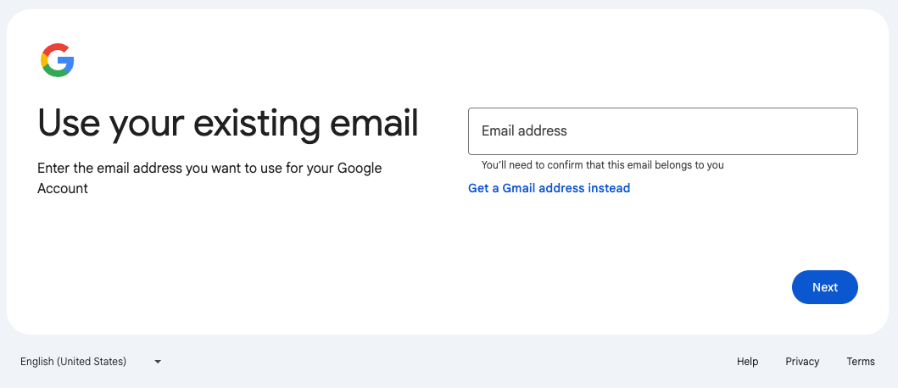
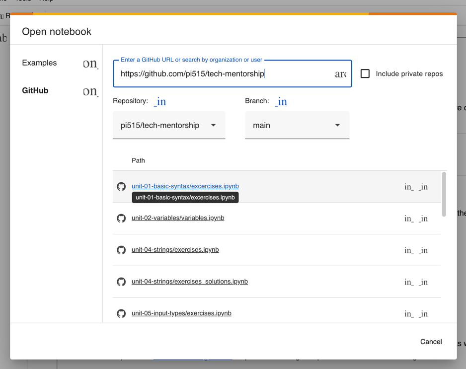

# Chapter 0 — Setup
This chapter covers the setup of your **development environment**. The Tech Mentorship Program uses the following tools:
* **Python**
* **Jupyter Notebooks** (organizes and runs Python)
* **Google Colab** (online Jupyter Notebook)

### Steps
-# Some steps below can expand with more information. Click on the step's text to show more.

#### 0. Do you have a Google account?
-  Yes ⇒ [click to go to step 2](#2-sign-in-to-google-colab)  
-  No ⇒ [click for step 1](#1-create-a-google-account)

#### 1. Create a Google account
######: Google requires a cell phone number to create an account. 

1. Go to https://accounts.google.com
2. 

Click<code>Create account</code>
    

    
    

3. 

Click <code>For my personal use</code>
    

    
    

4. 

Enter a name. Click <code>Next</code>
    

    
    

5. 

Enter a birthday / gender. Click <code>Next</code>
    

    
    

6. 

-- EITHER -- type in a new email account Click <code>Next</code>
    

    
    

7. 

-- OR -- click <code>Use your existing email</code>. And type in your current email.
    

    
    

8. Follow Google's instructions to create a password and ensure you'll remember it.

#### 2. Sign in to Google Colab
1. Go to https://colab.research.google.com

2. 

Click <code>Sign In</code>
   

   
   

3. Follow the Google sign-in process.
4. 

In Colab, click <code>File</code>in the top left corner
   

   
   

5. 

Click <code>Open notebook</code>
   

   
   

6. 

Click <code>GitHub</code>
   

   
   

7. 

   Copy and paste <code>https://github.com/pi515/tech-mentorship</code> into <code>GitHub URL</code>
   

   
   

8. Open your first Jupyter Notebook!
